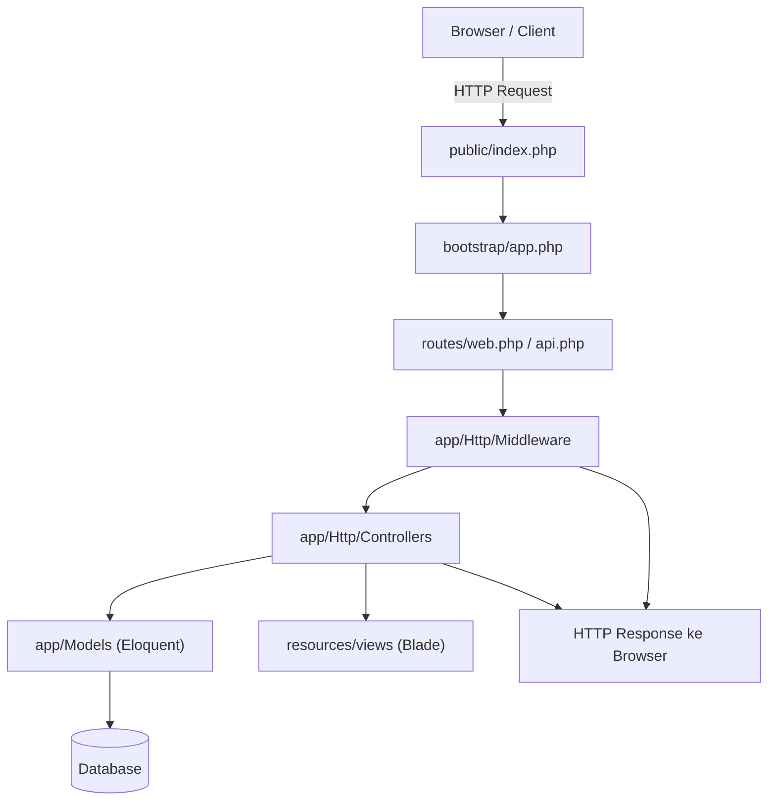

# 📒 Catatan Laravel – Struktur & Penjelasan Lengkap

## Gambaran Singkat

Proyek Laravel tipikal memiliki **file/folder** di root seperti:

```
artisan
composer.json
package.json
.env
app/
bootstrap/
config/
database/
public/
resources/
routes/
storage/
tests/
vendor/
```

Sekarang mari kita uraikan satu per satu dengan **detail**.

---

## 🗂 Root (Akar Proyek)

### **artisan**

* File executable PHP untuk CLI Laravel.
* Digunakan untuk menjalankan **perintah Artisan**, misal:

  ```bash
  php artisan migrate
  php artisan serve
  php artisan make:controller ProductController
  php artisan test
  ```
* **Tips:** Artisan adalah “toolbox” utama developer Laravel.

---

### **composer.json / composer.lock**

* Mendefinisikan dependency PHP proyek.
* Contoh perintah:

  ```bash
  composer install      # install semua dependency
  composer update       # update dependency
  ```
* composer.lock menjaga versi dependency konsisten antar developer.

---

### **package.json / package-lock.json / node_modules/**

* Mendefinisikan dependency frontend (JS/CSS).
* Laravel modern (9+) biasanya pakai **Vite**, file konfigurasi di `vite.config.js`.
* Proyek lama bisa pakai **Laravel Mix** (`webpack.mix.js`).

```bash
npm install        # install JS packages
npm run dev        # development
npm run build      # production (minify & bundle)
```

---

### **.env / .env.example**

* Konfigurasi environment: DB, MAIL, APP_KEY, APP_ENV, APP_DEBUG, dsb.
* Jangan commit `.env`. `.env.example` hanya sebagai template.
* **Tips:** Gunakan `.env` berbeda untuk local, staging, dan production.

---

### **README.md**

* Dokumentasi proyek: setup, run, dependencies, testing, deployment.

---

### **.gitignore**

* File/folder yang diabaikan Git:

  * `vendor/` → dependencies PHP
  * `node_modules/` → dependencies JS
  * `storage/logs/` → log aplikasi
  * `.env` → konfigurasi sensitif

---

### **server.php**

* Untuk built-in PHP server, jarang dipakai kecuali development.

---

### **phpunit.xml**

* Konfigurasi testing PHPUnit.
* Menentukan environment untuk unit/feature test.

---

## 🏗 **app/** — Inti Aplikasi (Kode PHP)

Berisi logika inti aplikasi: **Controllers, Models, Middleware, Providers, dsb.**

### Struktur Umum:

#### **app/Console/**

* Command Artisan kustom (`Commands/`) dan `Kernel.php` untuk scheduled tasks (cron jobs).

#### **app/Exceptions/**

* `Handler.php` menangani semua exception global.
* Bisa custom error message, logging, atau integrasi Sentry.

#### **app/Http/**

* **Controllers/** → MVC controllers (mis: `HomeController.php`, Auth controllers).
* **Middleware/** → request filter (auth, csrf, custom).
* **Kernel.php** → daftar middleware global dan route-specific.
* **Requests/** → Form Request classes untuk validasi terstruktur (`StoreUserRequest`).
* **Resources/** → kadang ada resource responses (API).

#### **app/Models/**

* Eloquent models (`User.php`, `Post.php`).
* Contoh: `fillable`, `guarded`, relationships (`hasOne`, `hasMany`, `belongsToMany`), casts, accessors/mutators.

#### **app/Providers/**

* Service providers (`AppServiceProvider`, `AuthServiceProvider`, `RouteServiceProvider`).
* Untuk binding service container, policy registration, event listener, dan route bootstrapping.

#### **app/Jobs/**

* Queue jobs (asynchronous tasks).

#### **app/Events/ & app/Listeners/ & app/Notifications/**

* Event-driven components dan notifikasi.

#### **app/Policies/**

* Authorization policies untuk model.

#### **Contoh Controller (Controller.php)**

```php
<?php
namespace App\Http\Controllers;
use Illuminate\Routing\Controller as BaseController;

class Controller extends BaseController {
    // Shared logic
}
```

---

## ⚡ **bootstrap/**

### **bootstrap/app.php**

* Membuat instance aplikasi Laravel (service container).
* Digunakan oleh Artisan & `public/index.php`.

### **bootstrap/cache/**

* File cache runtime: `config.php`, `routes.php`, `services.php`.
* Hasil perintah:

  ```bash
  php artisan config:cache
  php artisan route:cache
  php artisan package:discover
  ```

> **Tips:** Jangan edit manual file di sini.

---

## ⚙️ **config/**

* Folder konfigurasi, satu file per area. Bisa dicache (`config:cache`).
* Contoh:

  * `config/app.php` → APP_NAME, timezone, providers, aliases.
  * `config/database.php` → koneksi DB.
  * `config/mail.php`, `queue.php`, `cache.php`, `logging.php`.

---

## 🗄 **database/**

### **database/migrations/**

* Migration files: `2025_01_01_000000_create_users_table.php`.
* Jalankan:

  ```bash
  php artisan migrate
  ```

### **database/factories/**

* Generate dummy data untuk testing.
* Contoh: `UserFactory.php` menggunakan Faker.

### **database/seeders/**

* Seeders untuk isi data awal.
* Jalankan:

  ```bash
  php artisan db:seed
  ```

---

## 🌐 **public/**

* `index.php` → entry point semua request HTTP.
* `.htaccess` (Apache) → rewrite rules.
* Asset publik: `css/`, `js/`, `images/` (hasil build frontend).
* **Document root** untuk web server.

---

## 🖼 **resources/**

### **resources/views/** → Blade templates

* `.blade.php`, directive: `@extends`, `@section`, `@yield`, `@include`, `@component`.

### **resources/lang/** → Localization

* File terjemahan (en, id, dsb).

### **resources/js/** & **resources/css/** → Source frontend

* Entry point Vite (`app.js`, `app.css`)
* Bisa React/Vue + Tailwind config.

### **resources/sass/** → jika proyek lama menggunakan SASS/Mix.

---

## 🛣 **routes/**

* `routes/web.php` → Web routes (session/csrf middleware)
* `routes/api.php` → API routes (stateless, auth:sanctum)
* `routes/console.php` → Artisan command closures
* `routes/channels.php` → Broadcasting channel authorization

---

## 💾 **storage/**

* File uploads & storage internal aplikasi.
* `storage/framework/` → cache, views, sessions.
* `storage/logs/laravel.log` → logging
* **Symlink untuk public storage**:

  ```bash
  php artisan storage:link
  ```

---

## ✅ **tests/**

* `tests/Feature/` & `tests/Unit/` → testing route, response, DB assertion
* Jalankan:

  ```bash
  php artisan test
  ```

---

## 📦 **vendor/**

* Composer-managed packages
* Jangan commit (`.gitignore`)
* Semua framework code (Illuminate/Symfony) ada di sini.

---

## 🔑 **Fitur Penting Laravel**

* **Route Model Binding** → otomatis resolve model dari route parameter.
* **Eloquent ORM** → Relationships, Scopes, Accessors/Mutators, Casting.
* **Migrations** → versioned schema (`php artisan make:migration`)
* **Seeders & Factories** → generate data dummy (`php artisan db:seed`)
* **Artisan** → `php artisan list`
* **Tinker** → `php artisan tinker` (REPL)
* **Queues** → `php artisan queue:work`
* **Events & Listeners** → `php artisan make:event` / `make:listener`
* **Notifications & Mail** → `php artisan make:notification`
* **Policies & Gates** → `php artisan make:policy`
* **Caches** → `php artisan cache:clear`, `config:cache`, `route:cache`, `view:clear`
* **Scheduling (Cron)** → `app/Console/Kernel.php`, jalankan: `php artisan schedule:run`
* **Auth Scaffolding** → Breeze, Jetstream, Laravel/UI

---

## ⚡ **Tips Operasional**

* **APP_KEY:** `php artisan key:generate`
* **Migrate & Seed:** `php artisan migrate --seed`
* **Rollback:** `php artisan migrate:rollback` atau `migrate:fresh`
* **Cache untuk Production:**

  ```bash
  php artisan config:cache
  php artisan route:cache
  php artisan view:cache
  ```
* **Debugging:** `APP_DEBUG=true` (jangan di production)
* **Logging:** `storage/logs/laravel.log`
* **Environment:** `.env` berbeda tiap environment (local, staging, production)
* **Security:** jangan simpan secret di repo

---

## ⚡ **Modern Laravel Notes**

* Laravel 9+ → **Vite** (file: `vite.config.js`, blade directive `@vite(['resources/js/app.js'])`)
* Laravel <9 → **Mix** (`webpack.mix.js`)

---

## 🔄 Alur Request → Response (Diagram)



**Penjelasan Alur:**

1. **Browser / Client** → mengirim HTTP request
2. **public/index.php** → entry point Laravel, bootstrap app
3. **bootstrap/app.php** → buat instance Laravel & service container
4. **Router** → tentukan route → controller
5. **Middleware** → filter request (auth, CSRF, custom)
6. **Controller** → proses logika, validasi request
7. **Model / Database** → query atau simpan data
8. **View / Blade** → generate HTML jika web route
9. **HTTP Response** → dikirim balik ke browser

---


## 🗺 **Ringkasan Struktur Cepat**

| Folder       | Fungsi                                                     |
| ------------ | ---------------------------------------------------------- |
| `app/`       | Kode aplikasi (Controllers, Models, Middleware, Providers) |
| `bootstrap/` | Bootstrap app + cache runtime                              |
| `config/`    | Konfigurasi aplikasi                                       |
| `database/`  | Migrations, factories, seeders                             |
| `public/`    | Document root, assets, `index.php`                         |
| `resources/` | Views (Blade), lang, frontend source                       |
| `routes/`    | Web, API, console, channels                                |
| `storage/`   | Uploads, compiled views, logs, sessions                    |
| `tests/`     | Unit & feature tests                                       |
| `vendor/`    | Composer packages                                          |

---


